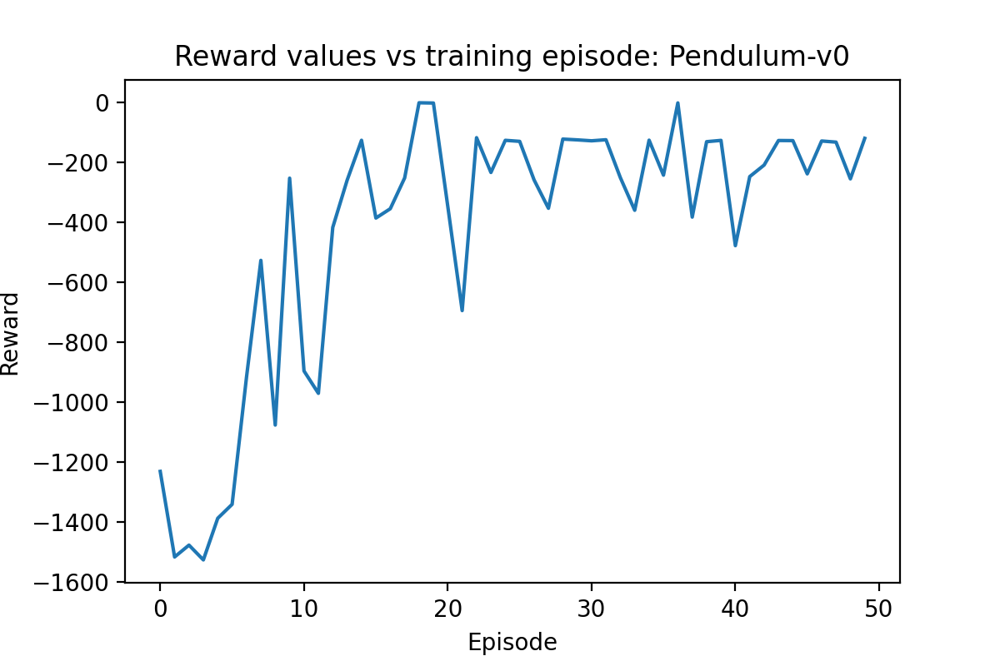
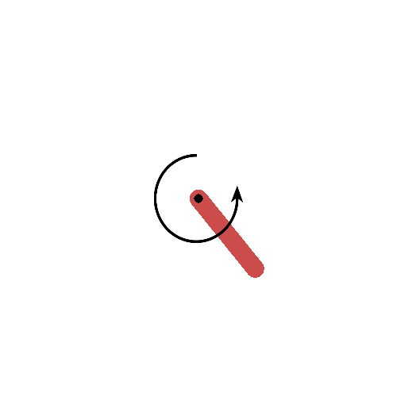
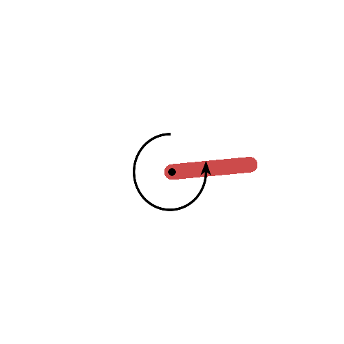
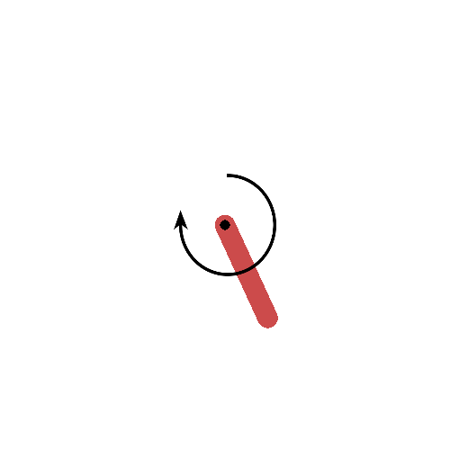
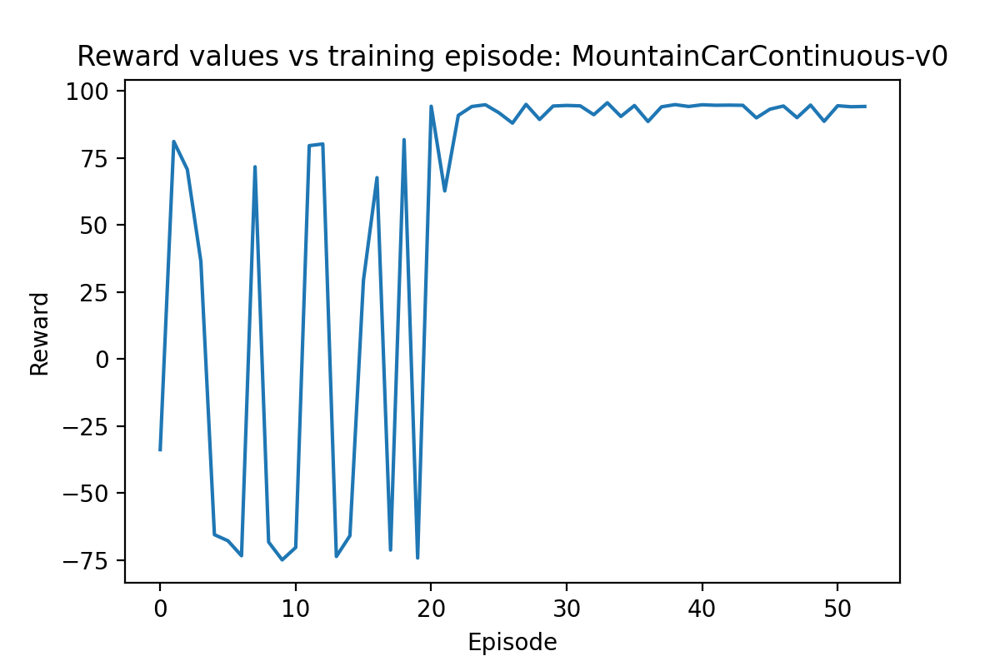
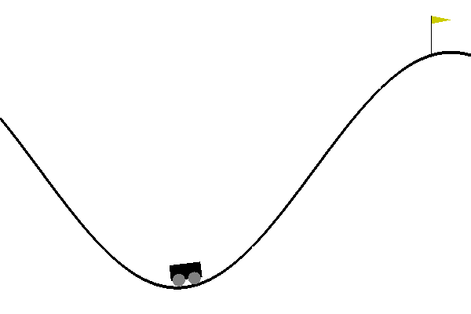
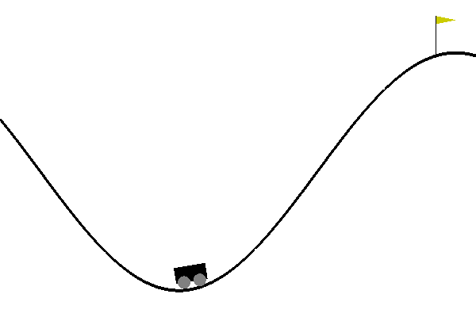
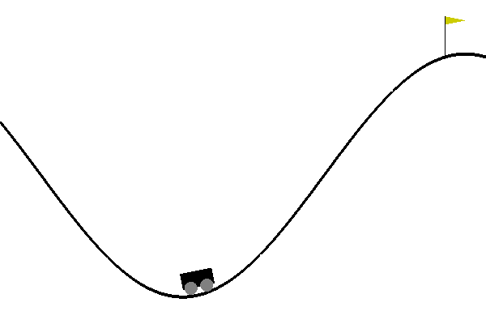
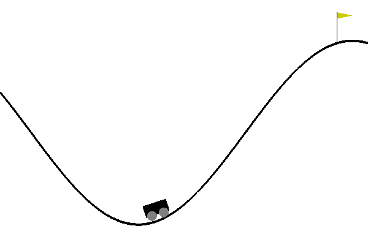
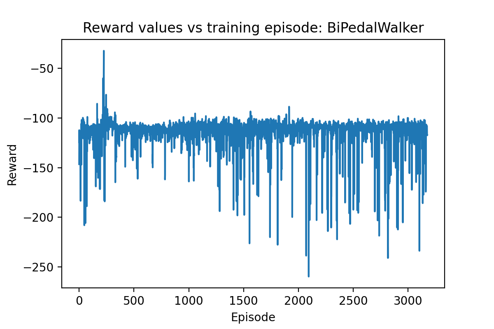

# Deep Deterministic Policy Gradient

This work using my implementation of the DDPG algorithm.

## Overview

These problems use a continuous action space rather than a discrete action space. Materially this means that rather than having one-hot encoded action vectors, they are normal vectors containing a value for each dimensions. This introduces a number of issues:

* The DQN algorithm in calculating the best Q value also selects the action with the best Q value at the same time. We cannot do this here.
* We now need two networks, an actor to decide on policy (i.e. a mapping of states to next states), and a critic to calculate Q values (i.e. a mapping of states + actions to expected rewards.
* As we are in a continuous action space, we can not longer use a random selection of a single action dimension for exploration. Instead we need to introduce a new type of noise. The ratio of this noise to the size of the actions taken is a new hyperparameter.
* These problems do not use unitary action spaces. That is the range of actions  possible in each action dimension can be higher or lower than 1.
* The DDPG Algorithm uses 2 sets of 2 networks. Both the actor and critic networks have shadow networks that the network parameter updates are gradually pushed to.
* Unlike the cartpole-v0 and lunarlander games in the DQN example these gyms do not have a terminal state (i.e. pole falls or lander crashes). As such the need to remember which states do not have next states is gone.

## Results
### Pendulum-v0
#### Rewards
This is a plot of the reward given to the agent as a function of the episode number. Note that the policy starts around halfway through the first episode. 

By the 13th episode the agent has learned to balance the pendulum. The variation in the reward after this point is entirely due to the random starting location of the pendulum. The spike around episode 37 is where the pendulum started near the top. The dips at episode 21 and 39 are where the pendulum started near the top but not close enough to take the shortest route to the top, and the agent had to do a swing down-then-up to get the pendulum to the top.

#### Episode Examples

**0th episode**

The agent starts by taking completely random actions in an attempt to explore the state space, and build enough state-action-reward transition to do fill a batch for stochastic gradient decent. Once we have enough transitions the agent locks into a strong counter-clockwise action.

**5th episode** 

The agent has learnt to swing the pendulum up, but does not yet know how to get it vertical.

**10th Episode**

Pendulum is nearing vertical.

**15th Episode**

Agent has learnt to balance the pendulum. Note some oscillations still exist around perfectly vertical.

**40th Episode**

Oscillations around vertical reduced.

## MountainCarContinuous-v0

Reward plot for the latest MountainCarContinuous-v0. The agent is able to solve the problem in the second episode but is unable to consistently solve it until the 30th.

#### Episode Examples

**0th Episode**

Initial exploration of the state space. As the length of each episode if 1000 and our batchsize is 128, we are able to spend the majority of the first episode exploiting our strategy and are almost able to solve it on the first shot.

**5th Episode**

Correct policy is executed initially but it isn't quite good enough to get to the goal. The agent then tries again and is successful

**10th Episode**

Here the agent isn't really using the other hill to gain momentum, but is able to get to the goal.

**20th Episode**
Here is the first episode where the agent gets to a policy that really works well. You can see it leverages the other hill.

**25th Episode**

This is the last episode where the agent is not successful. I don't know if it fails to solve due to the exploration noise thwarting the agent at the wrong time or a poor policy.

**30th Episode**

This is the final state of the agent. It solves the problem rapidly.

## BiPedalWalker

Reward plot for the latest BiPedalWalker. The agent is still unable to solve this environment with DDPG but it is close.

Things I have tried to fix this:
+ added batchnorm1d's to the network and this has not helped.
+ Modified the reward function to add a 0.1 reward for not falling over. THis was to escape a local minimum that caused the walker to prefer a fast dive for the ground over a long period of standing, and attempting to walk and falling over.

I suspect the issue with the system are presently twofold.
1. This environment has terminal states unlike the previous 2 solved with DDPG. I wonder if this is the issue.
2. This envionrment has a 26 dimensional state space that is not normalised. Contact point is a bool (actually an int from 0-1) but lidar measurements are distances (non-bounded floats). Perhaps normalising the environment would help.

## Mistakes I made implementing this
1. I started on the BiPedalWalker gym. This is a gym with sparse rewards and large state space. This makes a poor choice for a learning problem. I spent far too long trying to get this working before I opted to change to a different gym to debug my algorithm.  Eventually switched to the mountaincarcontinuous problem which is also a poor choice due to sparse rewards and the difficulty in reaching an end state with random noise. When the algorithm did not work I switched to the inverted pendulum problem which has a much lower state and action space size and is a much better suited problem for learning.
2. I did not scale my actor network outputs to the gym action space size. In the inverted pendulum problem you may apply torques of up to 2 units. In my initial work on this problem the outputs of my actor network was a tanh function which gave action values between -1 and 1. This was not suffucient to solve the problem.
3. Too much focus on hyperparameter tweaking and not enough on debugging. When the problem wouldn't work I spent a long time tweaking hyperparameter in an attempt to jolt the algorithm into running. 
   I changed the following values to do this:
   + learning rates of the actor and critic networks
   + number of hidden layer and the size in both networks
   + Altered weight initialisation methods on the networks
   + memory buffer size
   + batch size
   + Noise to action state ratio
   + soft update scalar (tau)
   + Applied Batch Normalisation to both networks.
   + Ran for 10000 episodes.

Then I tried some more dramatic changes:

1. Introduced non-standard rewards

Ultimately the issue was around the discarding of end state rewards referenced above. As soon as I dropped the terminal state modifier to the bellman equation the algorithm worked.

