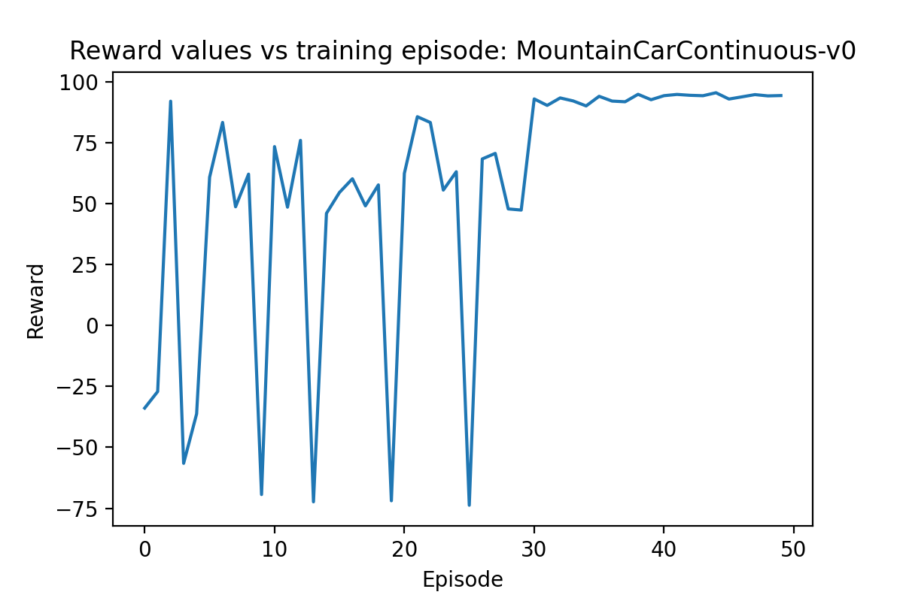

# Deep Deterministic Policy Gradient

This work using my implementation of the DDPG algorithm.

## Overview

These problems use a continuous action space rather than a discrete action space. Materially this means that rather than having one-hot encoded action vectors, they are normal vectors containing a value for each dimensions. This introduces a number of issues:

* The DQN algorithm in calculating the best Q value also selects the action with the best Q value at the same time. We cannot do this here.
* We now need two networks, an actor to decide on policy (i.e. a mapping of states to next states), and a critic to calculate Q values (i.e. a mapping of states + actions to expected rewards.
* As we are in a continuous action space, we can not longer use a random selection of a single action dimension for exploration. Instead we need to introduce a new type of noise. The ratio of this noise to the size of the actions taken is a new hyperparameter.
* These problems do not use unitary action spaces. That is the range of actions  possible in each action dimension can be higher or lower than 1.
* The DDPG Algorithm uses 2 sets of 2 networks. Both the actor and critic networks have shadow networks that the network parameter updates are gradually pushed to.
* Unlike the cartpole-v0 and lunarlander games in the DQN example these gyms do not have a terminal state (i.e. pole falls or lander crashes). As such the need to remember which states do not have next states is gone.

## Mistakes I made implementing this
1. I started on the BiPedalWalker gym. This is a gym with sparse rewards and large state space. This makes a poor choice for a learning problem. I spent far too long trying to get this working before I opted to change to a different gym to debug my algorithm.  Eventually switched to the mountaincarcontinuous problem which is also a poor choice due to sparse rewards and the difficulty in reaching an end state with random noise. When the algorithm did not work I switched to the inverted pendulum problem which has a much lower state and action space size and is a much better suited problem for learning.
2. I did not scale my actor network outputs to the gym action space size. In the inverted pendulum problem you may apply torques of up to 2 units. In my initial work on this problem the outputs of my actor network was a tanh function which gave action values between -1 and 1. This was not suffucient to solve the problem.
3. Too much focus on hyperparameter tweaking and not enough on debugging. When the problem wouldn't work I spent a long time tweaking hyperparameter in an attempt to jolt the algorithm into running. 
   I changed the following values to do this:
   + learning rates of the actor and critic networks
   + number of hidden layer and the size in both networks
   + Altered weight initialisation methods on the networks
   + memory buffer size
   + batch size
   + Noise to action state ratio
   + soft update scalar (tau)
   + Applied Batch Normalisation to both networks.
   + Ran for 10000 episodes.

Then I tried some more dramatic changes:

1. Introduced non-standard rewards

Ultimately the issue was around the discarding of end state rewards referenced above. As soon as I dropped the terminal state modifier to the bellman equation the algorithm worked.

## Results
### Pendulum-v0

## MountainCarContinuous-v0

Reward plot for the latest MountainCarContinuous-v0.

## BipedalWalker

Reward plot for the latest BipedalWalker.

