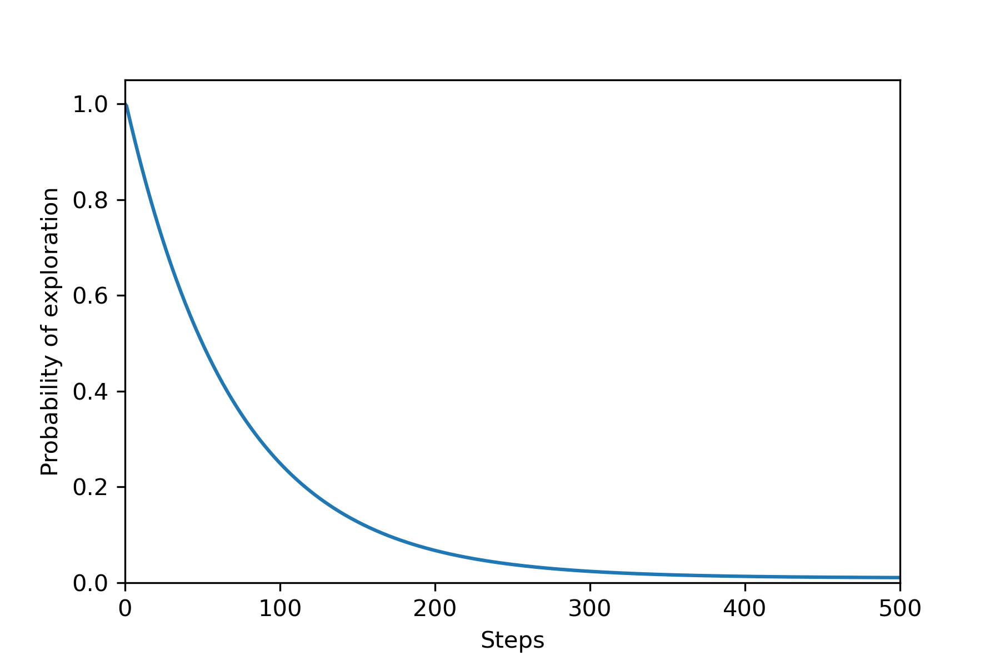

# Lunar Lander -v2

## Outline
In this work I use an epsilon greedy Deep Q Network to solve the LunarLander-v2 problem from AIGym.

A description of the problem is as follows:

Your goal is to land a small craft on a landing pad using 3 actions, rotate left, rotate right and fire main engine.

__Rules__

+ Landing pad is always at coordinates (0,0). 
+ Coordinates are the first two numbers in state vector. 
+ Reward for moving from the top of the screen to landing pad and zero speed is about 100..140 points. 
+ If lander moves away from landing pad it loses reward back. 
+ Episode finishes if the lander crashes or comes to rest, receiving additional -100 or +100 points. 
+ Each leg ground contact is +10. 
+ Firing main engine is -0.3 points each frame. 
+ Solved is 200 points. 
+ Landing outside landing pad is possible. 
+ Fuel is infinite, so an agent can learn to fly and then land on its first attempt. 
+ Four discrete actions available: do nothing, fire left orientation engine, fire main engine, fire right orientation engine.

## Solution

To solve this problem I use a epilson greedy Deep Q network. This method takes the current state as the input and based on a history of past `action, state, next-state, reward` transitions attempts to predict what the optimal action to take is to maximise the reward.

__Epsilon Function__

At each step in an episode the network must choose to exploit the current strategy or to explore the environment and learn more. The probability of exploring the environment (by taking a random action) is given by the epsilon value plotted below. Note that for my solution, no Q-network parameter updates can take place until the agent has experienced a large number of states. As such my epsilon value stays at 1 for a number of episodes at the start of the training.

__Reward Function__

This is a plot of the reward as a function of episode. 

Note: completely random behaviour gives a reward around -180. 
The problem is considered solved at a reward of 200+. 

*Early Episodes*

The network rapidly learns basic control of the lander within around 20 episodes. 

*Middle Episodes* 

This is followed by a period of greatly decreased variability in the reward for the next 100 episodes. This stable part of the learning is where the lander is hovering at ever lower atitudes. Gradually we see an uptick in reward as the lander starts making contact with the ground around step 160. It continues landing / crashing on one leg for some time.

*End Episodes*

Around episode 280 the lander makes its first landing with both legs on the landing pad, and there is an immediate increase in reward. This is the most frustrating part of the simulation to watch as the lander will often go straight down onto the landing pad, then either fly away, or continue to hover over the landing pad at very low altitude for an extended period. The source of variability in this section is mostly due to the lander ending with one or two legs in the landing pad, or hovering for too long above the landing pad before landing.

Following this we see an increased level of variability. The majority of these massive negative reward episodes is when the lander attempts an aggressive descent and ends up upside down or over corrects and flys off the edge of the screen. By the end of the training period we are regularly getting scores over the 'solved' level.

## Snapshots
Below is a snapshot of some episodes:

__Step 0__

At this point we are taking completely random actions to generate a large batch of transitions. Once our collection of transistions is sufficiently large, we being to train a neural network to appoximate the value of taking an action given any state.

__Step 10__

The agent has learned to control descent velocity but not orientation.

__Step 50__

By this stage the lander has learned basic hovering behaviour. Note that due to the fuel consumption penalty hovering until the end of the simulation is not a good strategy. Also note that due to the heavy crashing penalty it also prefers to land on it's legs even if it is uncontrolled.

__Step 100__

This is an excellent example of the middle period stability. The agent now understands basic hovering skills and is targetting the landing pad, but is unable to land on it.

__Step 150__

Again the agent clearly knows how to hover and is targetting the landing pad, but hasn't quite learned how to slow down to land.

__Step 250__

Agent is landing lander on one leg right in the middle of the pad, but is not oriented correctly and breaks the leg.

__Step 350__

A solved solution.

## Action Histogram

Above is a histogram of the actions taken every 50th episode. You can clearly see that the first training episode has an epsilon of one and the actions are roughly uniformly distributed.

As we get to the middle 'hovering' period there is a greater focus on stability with the main engine action becoming dominant and the left and right thrusters being used equally to keep the lander upright. Note that episode 200 the lander continues to hover until a timeout period is reached and the simulation ends *without a crash*.

Towards the later part of the training the agent learns that *do nothing* is a valid policy once on the landing pad.
